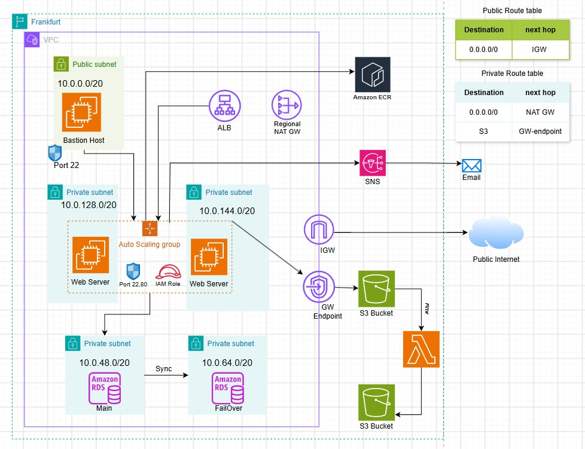

# End-to-End AWS Cloud Architecture: High-Availability Flask Web App & Serverless Image Filtering Pipeline

## 📌 Project Summary
I designed and manually provisioned this multi-tier cloud architecture from scratch in the AWS **Frankfurt** region. The project features a Dockerized Python Flask web application deployed via `Amazon ECR` across a private `Auto Scaling group`, backed by a Multi-AZ `Amazon RDS` database and an event-driven AWS `Lambda` pipeline that automatically applies an image `Filter` to files uploaded to Amazon S3.

---

## 🌐 Custom Network & Routing Design

The custom `VPC` is segmented into isolated public and private tiers across five subnets with dedicated route tables:

| Tier | Subnet CIDR | Provisioned Resources | Route Table Configuration |
| :--- | :--- | :--- | :--- |
| **Public Tier** | `10.0.0.0/20` | `Bastion Host` (`Port 22`) | `0.0.0.0/0` -> `IGW` |
| **Private App Tier** | `10.0.128.0/20`, `10.0.144.0/20` | Containerized Flask `Web Server` EC2s in `Auto Scaling group` | `0.0.0.0/0` -> `NAT GW` `S3` -> `GW-endpoint` |
| **Private DB Tier** | `10.0.48.0/20`, `10.0.64.0/20` | `Amazon RDS` (`Main` & `FailOver`) | Internal VPC Routing |

---

## 🛠️ Architecture & Implementation Breakdown

### 1. VPC Networking & Private Connectivity
* Provisioned a custom `VPC` in **Frankfurt** with an Internet Gateway (`IGW`) and a `Public Route table` (`0.0.0.0/0` -> `IGW`).
* Deployed a `Regional NAT GW` in the `Private Route table` (`0.0.0.0/0` -> `NAT GW`) so private instances can securely pull packages and container images without public IP exposure.
* Configured a VPC Gateway Endpoint (`GW Endpoint`) for `S3` (`S3` -> `GW-endpoint`) so all image transfers between the `Web Server` instances and the `S3 Bucket` remain on the private AWS network.

### 2. Containerized Flask Application & Auto Scaling (`my-flask-app/`)
* Developed a Python Flask web application (`app.py`, `templates/index.html`, `requirements.txt`) and packaged it into a container image using a custom `Dockerfile` and `.dockerignore`.
* Pushed the container image to `Amazon ECR`.
* Configured an EC2 `Auto Scaling group` across private subnets `10.0.128.0/20` and `10.0.144.0/20` with an attached `IAM Role` (granting ECR pull and S3 access) and Security Group rules for `Port 22,80`.
* Placed an Application Load Balancer (`ALB`) in front of the `Auto Scaling group` for HTTP traffic distribution, a `Bastion Host` (`Port 22`) in `10.0.0.0/20` for SSH management, and Amazon `SNS` notifications to send `Email` alerts on scaling events.

### 3. Resilient Database Layer & Cost Optimization
* **Subnet Group Design:** Created a multi-AZ DB subnet group across two Availability Zones (`10.0.48.0/20` and `10.0.64.0/20`) to ensure network-level high availability readiness.
* **Production vs. Lab Trade-off:** 
  * *Intended Production Spec:* High-availability `Multi-AZ` synchronous replication with automated failover.
  * *Provisioned Lab Spec:* Deployed as a `Single-AZ` instance strictly to adhere to AWS Free Tier limits and prevent unnecessary operational costs, with seamless one-click failover enablement ready via the existing Multi-AZ subnet topology.

### 4. Serverless S3 & Lambda Image Filtering Pipeline
* **Private Upload:** Users upload raw images through the Flask `Web Server`, which writes objects to the source `S3 Bucket` via the `GW Endpoint`.
* **Automated Image Filter:** Uploading an image triggers an AWS `Lambda` function that applies an image `Filter` to the file.
* **Processed Storage:** The `Lambda` function saves the filtered output image into a second destination `S3 Bucket`.
